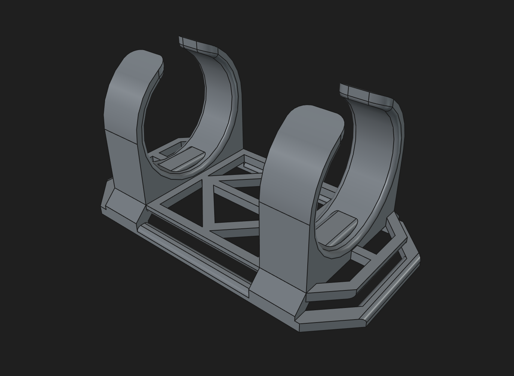

# Flashlight-To-Headlamp
Making a P7R Signature headlamp adapter.

I used to think that all I need is a flashlight. But after having to setup camp fast in the rain in the dark, I very quickly changed my opinion.
Since all decent headlamps are expensive and I still want to use my trusty Ledlenser P7R Signature, I decided I will make an adapter.

Using freecad I designed this 3d model that snuggly fits the light.

I 3d printed the model out of PETG Transluscent from Bambulab (On my A1 mini).

Then I bought some 30mm elastic strap and (non elastic) string.

   

I also 3d printed these two models THAT ARE NOT MINE:
- https://makerworld.com/en/models/669780-strap-adjuster-buckle-25mm
- https://makerworld.com/en/models/1452797-quick-slip-strap-keeper-buckle

   

So I trimmed the strap to the right length. I folded the ends and sew the folds together. Pro tip, to keep the fabric from breaking apart at the end, give it a little super glue and it will very nicely harden and hold (same for fixating knots).

   

And this is the finished product. I thought it would be more uncofertable since the flashlight is quite heavy, but the strap is really wide and the light sits on top of my ear so it does not move much, and it does not feel heavy.

   

   
